# Kubernetes
## Integrantes:
- Armas Alejandro 
- Catota Luis
- Guala Paul 
- Guallichico Nataly

 
## **Acerca del proyecto**

El siguiente proyecto consiste en diseñar, implementar y cotizar una solución de balanceo de carga y failover.

Se realizó una página web en WordPress, dicha aplicación se encuentra replicada en varios nodos dentro de un cluster en Kubernetes. También se realizó una simulación de falla en alguno de los servidores(nodos) para que el orquestador en este caso kubernetes puedo levantar un nuevo servidor automáticamente.

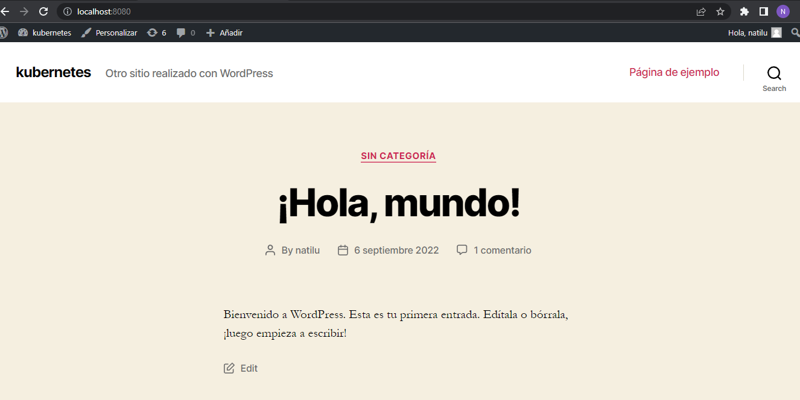  

## **Herramientas**

Las herramientas utilizadas para el presente proyecto son las siguientes: 

- Docker

Es un proyecto de código abierto que automatiza el despliegue de aplicaciones dentro de contenedores de software, proporcionando una capa adicional de abstracción y automatización de virtualización de aplicaciones en múltiples sistemas operativos.

- Docker Hub

Es un repositorio público en la nube, similar a GitHub que distribuye los contenidos. Esta mantenido por la propia Docker y hay una multitud de imágenes que son gratuitas, lo que nos permite poder utilizar sus plantillas y ahorrarnos el trabajo de empezar desde cero.

- Minikube 

Es una  herramienta opensource que mediante la creación de una máquina virtual nos permite disponer de un entorno sencillo de kubernetes con la mayor parte de sus funcionalidades.

- POD

Un pod de kubernetes es un conjunto de uno o varios contenedores y constituye la unidad mas pequeña de las aplicaciones de kubernetes.  Puede estar compuesto por un solo contenedor, en un caso de uso común, o por varios con conexión directa, en un caso de uso avanzado.

- Kubernetes con Docker

Kubernetes y Docker funcionan juntos. Docker proporciona un estándar abierto para empaquetar y distribuir aplicaciones en contenedores. Con Docker, puede crear y ejecutar contenedores, así como almacenar y compartir imágenes de contenedor. Se puede ejecutar fácilmente una compilación de Docker en un clúster de Kubernetes

## **Arquitectura**

La arquitectura que se utilizo para el presente proyecto es la siguiente:

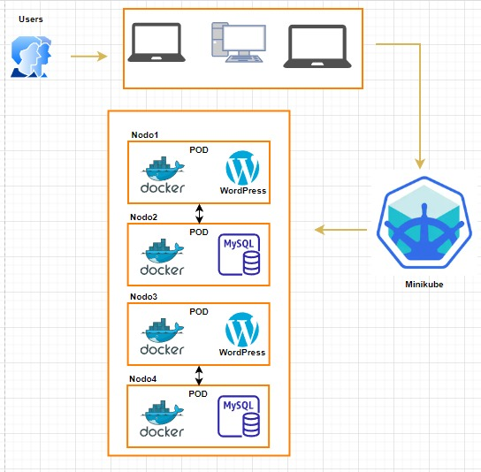  

## **Desarrollo**

Se procederá a utilizar el archivo <em>doker-compose.yaml</em>, en donde tenemos los servicios que vamos a crear, en este caso tenemos los servicios de wordpress y de mysql, en dicho archivo se encuentran las caracteristicas y especificaciones de las imagenes que crearemos en nuestro docker.

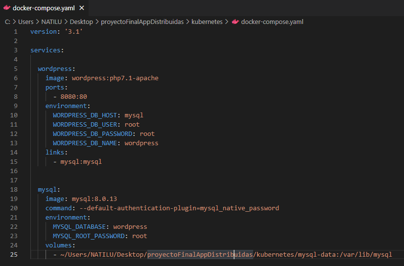  

Una vez configurado nuestro archivo <em>docker-compose.yaml</em> procederemos a utilizar en nuestra terminal el siguiente comando <em>docker-compose up -d</em> que nos permitira correr el docker compose y levantar el contenedor, posterior a eso utilizaremos el comando <m>docker ps</m> para poder visualizar los contenedores que estan corriendo

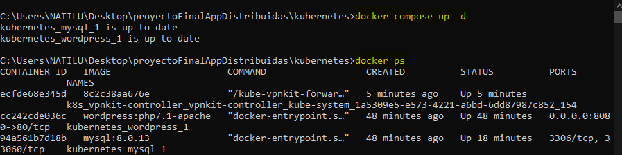  

Ahora crearemos una imagen en nuestro docker a partir de los cambios en el contenedor con el comando <em>docker commit id(el id representa al id de nuestro contendeor)</em> y con el comando <em>docker image ls</em> visualizaremos las imagenes de los contenedores

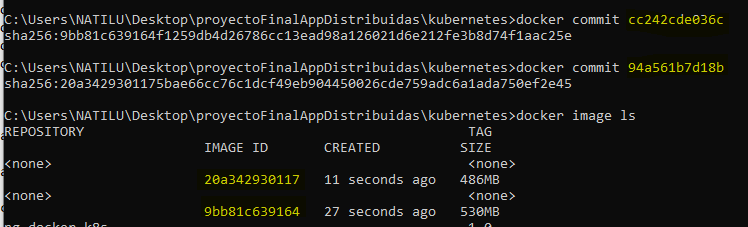  

Renombraremos nuestra imagenes creadas con el comando <em>docker image tag id(el id representa el id generador por el contenedor) y el nombre que queremos ponerle, se debe anteponer el nombre de usuario de dockerhub</em> ejemplo <em>docker image tag 102816b1ee7d natilu01/my-sql:latest</em>
 
 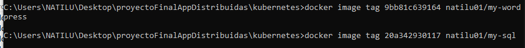  

- Verficación de la creacion de imagenes en nuestro docker.
 
 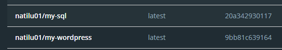  
 

Para subir las imagenes a nuestro dockerHub pondremos realizarlo con el siguiente comando <em>docker push nombre de la imagen </em> o de manera grafica dando click en los tres puntos en la parte derecha de las imagenes creadas  y seleccionar la opción <em>Push to Hub</em> y las imaganes se subiran a nuestro docker Hub.

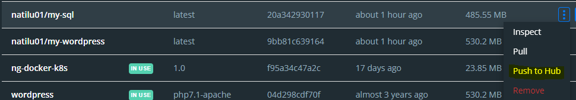  

- Verificación de las imagenes subidas a Docker Hub

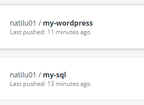 
## **Kompose**

Kompose es un software creado por google para que los archivos .yaml necesario para levantar una aplicación en minikube y puedan ser manipuladas por kubernetes, puedan ser creados automaticamente a partir del archivo docker.compose.yml

Mendiante el comando:
 - Kompose convert -f docker-compose.yml
 
 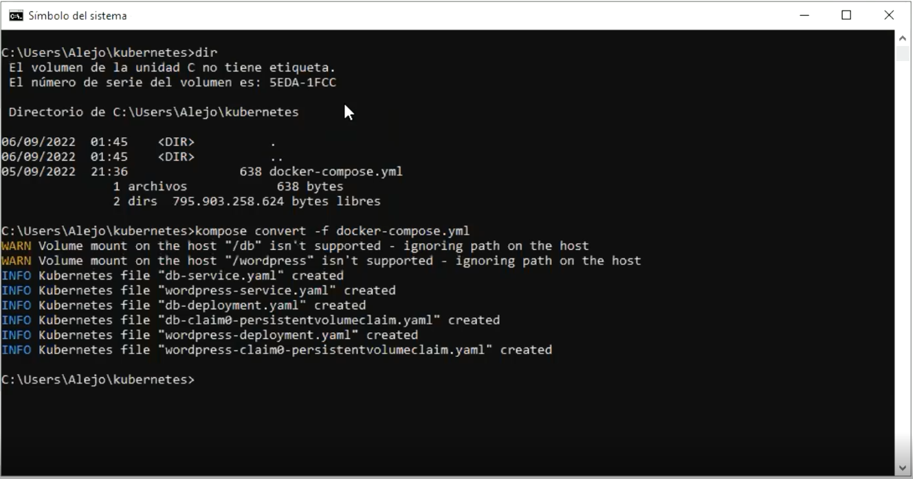
 
## **Minikube**

Minikube es una máquina virtual diseñada por google para realizar pruebas mediante pods con kubernetes, tiene la capacidad de bajar imagenes de docker hub o correr imágenes locales.

Para su instalación se procede a correr el siguiente comando:
- minikube start --driver=virtualbox --no-vtx-check

 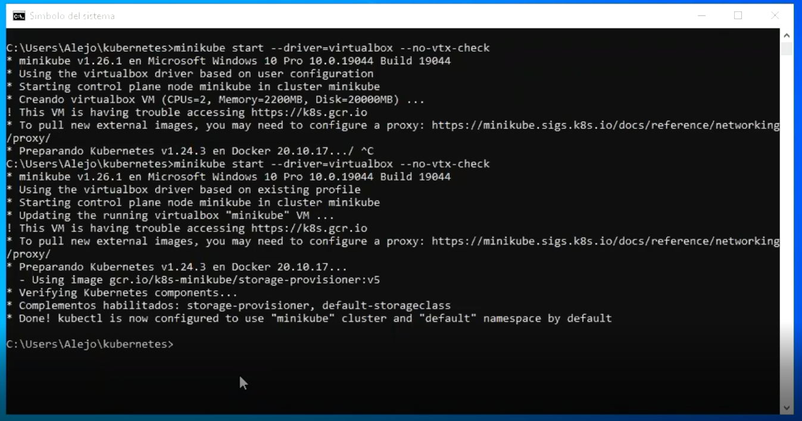

## **Levantamiento de Wordpress en Minikube**

Para empezar debemos correr cada uno de los archivos .yaml creados por kompose dentro de minikube con el siguiente comando:
 
 - kubectl apply -f nombrearchivo.yaml 

 
 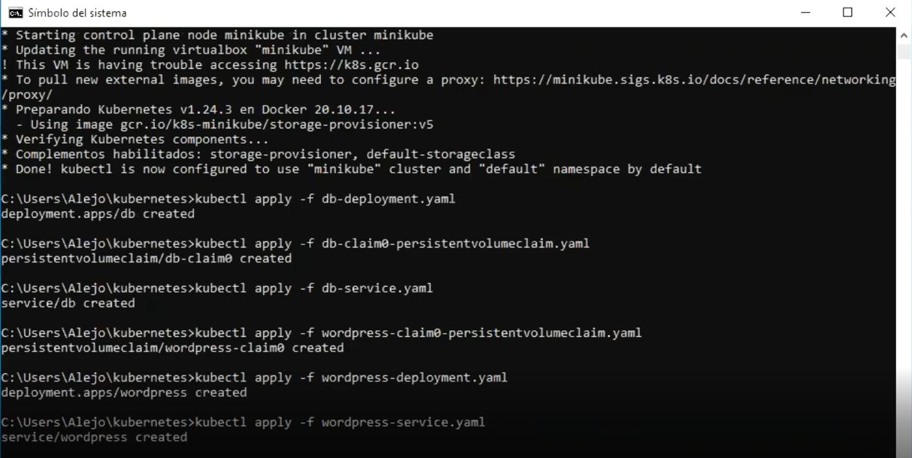
 
 
Para poder crear el número de réplicas que necesitamos de nuestros contenedores, lo que se debe hacer es dentro de nuestro archivo nombre-deployment.yaml en la línea que dice réplicas poner el número que necesitamos que en este caso para la prueba será de tres. Haciendo que minikube las cree y podamos empezar a trabajar con ellas mediante kubernetes

 
  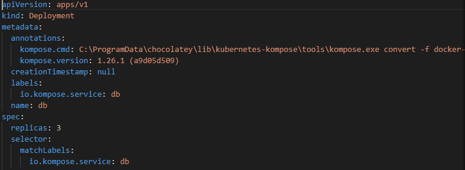
 

## **Enlaces**

['Explicación Técnica de la Arquitectura y funcionalidad'](https://www.youtube.com/watch?v=0h6QKsixGVg)  
 
